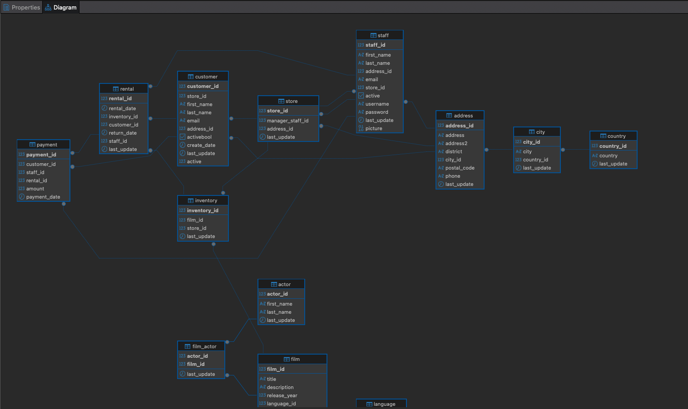
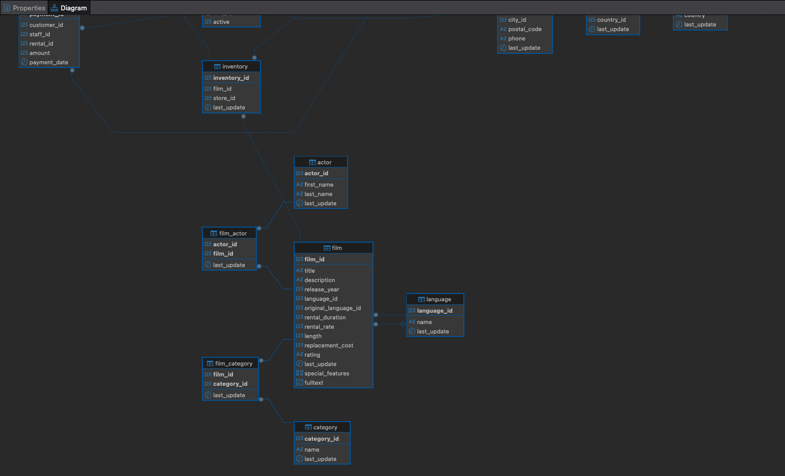

# Pasos seguidos:

Al principio me encontré con varios errores:

> role "postgres" does not exist porque el dump hacía OWNER TO postgres.

> must be owner of schema public y must be owner of language plpgsql por órdenes que requieren superusuario.

> permission denied: "RI_ConstraintTrigger_..." al intentar DISABLE/ENABLE TRIGGER ALL.

> Tablas “vacías” por ejecutar solo parte del script en DBeaver.

> 23505 duplicate key al reimportar sin limpiar antes.

Para solucionarlo, generé un SQL limpio eliminando OWNER TO, cambios sobre schema public, plpgsql y (en una v2) los ENABLE/DISABLE TRIGGER. Cargué los datos de forma fiable (usando un data-only o el clean_v2 completo) tras un TRUNCATE … RESTART IDENTITY. En el ciclo store ↔ staff quité temporalmente esas dos FKs, importé y luego las recreé. Después ajusté secuencias, ejecuté ANALYZE y refresqué DBeaver para generar el ER diagram.

Verifiqué la carga: conteos correctos, todos los clientes tienen rentals, hay 3 películas sin actores (propio del dump) y original_language_id viene todo NULL (no es fallo mío). Resultado: la base quedó lista para consultas y análisis (ingresos por tienda/mes, top películas/clientes, etc.).

A partir de ahí realicé todas las consultas requeridas en el ejercicio.

# Informe:

Tablas clave: film, actor, film_actor, category, film_category, inventory, rental, payment, customer, store, staff

Volúmenes confirmados:

Films: 1.000

Actors: 200

Customers: 599

Films sin actores: 3 (el resto aparece en film_actor)

Actores sin películas: 0 (todos aparecen en film_actor)

> Estructura sólida y normalizada: el modelo está bien definido, sin registros huérfanos aparentemente.

> Consistencia de negocio: Todos los clientes tienen al menos un alquiler y todos los actores aparecen en alguna película (salvo 3 sin reparto).

> Limitación: film.original_language_id está todo a NULL en el dump.

> Trazabilidad económica: payment.amount enlazables a película y tienda.

## Diagrama:  

